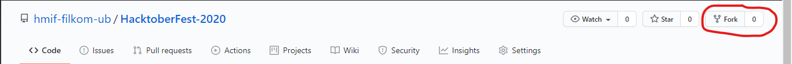
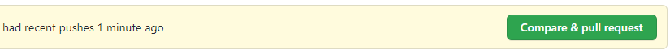

[](https://hacktoberfest.digitalocean.com/)

# HMIF - HacktoberFest 2020
HMIF turut berpartisipasi dalam [Hacktoberfest](https://hacktoberfest.digitalocean.com/), sebuah gerakan sosial oleh _DigitalOcean_ yang mengajak developer-developer di seluruh dunia untuk bersama-sama berkontribusi pada projek _[open source](https://id.wikipedia.org/wiki/Sumber_terbuka)_ yang menempatkan [_repo_](https://www.hostinger.co.id/tutorial/apa-itu-github/#:~:text=Repositori%20atau%20repo%20adalah%20direktori,repositori%20lokal%20di%20komputer%20Anda.)-nya di github. 

### What's the Benefit?
**Hanya** dengan mengajukan _pull request_ sebanyak **4 kali**-pada _repo_ **apapun**, selain mendukung gerakan _open source_ kamu juga berkesempatan untuk mendapatkan **merch** berupa kaos dan stiker menarik ekslusif dari HacktoberFest 2020!
*(limited by 75000 t-shirts & a lot of stickers..)

### What's This Repo About?
_HMIF - HacktoberFest 2020_ ini dibuat untuk mewadahi warga Himpunan Mahasiswa Informatika FILKOM UB yang ingin berpartisipasi dalam mendukung gerakan _open source_ dan tentunya _HacktoberFest 2020_. 
Silahkan _upload_ dan _pull request_ karya terbaik kalian dalam _repo_ ini.

### Before Start
- Komputer sudah terinstall [git](https://git-scm.com/downloads)
- Bisa dasar-dasar git (belajar dasar dasar git [disini](https://www.petanikode.com/tutorial/git/))

### How to Start
1. Daftarkan akunmu [disini](https://hacktoberfest.digitalocean.com)
2. Kemudian _fork repository_ ini

3. Cek _repository_ yang baru saja kamu _fork_, kemudian _clone_ di komputer kamu
```sh
git clone https://github.com/{ user name kamu }/HacktoberFest-2020.git
```
4. Letakkan _file_ dengan membuat _folder_ baru pada _repository_ lokal sesuai dengan **ketentuan projek akhir** dibawah
5. Lakukan **commit** dengan buat **branch** baru, jangan menggunakan **branch** master ya. Sertakan komentar pada **commit** jika memungkinkan.
```sh
mkdir nama_nim && cd nama_nim
git checkout -b nama_branch
git add .
git commit -am "komentar"
```
6. Kemudian lakukan **push** ke _repository_ hasil fork kamu
```sh
git push -u origin nama_branch
```
7. Setelah itu silahkan lakukan **pull request** pada github

8. Jangan lupa ⭐️ repo ini jika kalian suka dan cantumkan username github kalian di bagian kontributor

### Ketentuan Projek yang Diterima
1. Projek akhir yang diajukan adalah **harus murni hasil karya sendiri**
2. Silahkan membuat _folder_ baru dengan nama **nim_nama** kamu, letakkan projek akhir di dalam folder tersebut.
3. Hanya diperbolehkan meletakkan _file_ berekstensi seperti Java, Kotlin, C, Python, IPyNB, dll. atau _folder_ berisikan _framework_ contohnya seperti _Code Igniter, Laravel, Android Studio, dsb_. **Tidak diperkenankan** meletakkan dokumen _word_, _pdf_, dan sejenisnya
4. Beri nama _file_ sesuai dengan tujuan algoritma _codingan_ tersebut.

### How We Maintenance Your Project
_Pull request_ akan diproses sesuai dengan **ketentuan projek** diatas. _Pull request_ yang diterima akan diberikan label **hacktober-accepted**.

### Pertanyaan, Kritik, dan Saran
Ajukan pertanyaan, kritik, dan saran mu dengan membuat _issue_ pada _repository_ ini.

### Batas Akhir HacktoberFest 2020
This repository will be accepted for Hacktoberfest only till **30th October 2020** 11:59 PM GMT